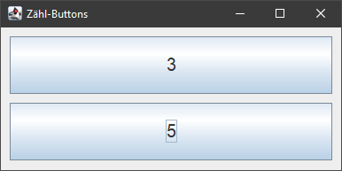

# Lambda-Demo #

 

Dieses Repo enthält ein Eclipse-Projekt mit einigen Beispiel-Dateien zur Demonstration von Lambda-Ausdrücken in Java.

 

----

## Screenshot ##

 

Das Repo enthält u.a. eine Klasse für eine kleine Swing-Applikation, die folgende Oberfläche hat:

 

----

## License ##

 

See the [LICENSE file](LICENSE.md) for license rights and limitations (BSD 3-Clause License).

 